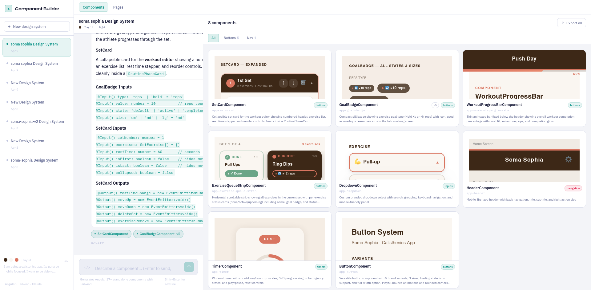

# Component Builder

A vibe-coded, AI-powered design tool that generates Angular component libraries and interactive page mockups through a chat interface. The aim is to build fast and easy component libs that have consistent design and make it easy to iterate over them. See [Why](#why) for the backstory.




https://github.com/user-attachments/assets/3cb05e80-e742-41ba-9975-55fd751bd77b


---

## Getting Started

### Prerequisites

- Node.js 18+
- An [Anthropic API key](https://console.anthropic.com/)

### Setup

```bash
# Install dependencies
npm install

# Set your API key
echo "ANTHROPIC_API_KEY=sk-ant-..." > .env.local

# Start the dev server
npm run dev
```

Open [http://localhost:3000](http://localhost:3000).

On first launch the onboarding wizard will walk you through naming your design system, picking brand colors, and describing your app. This takes about a minute and only runs once.

---

## Why

I started vibe coding a small homemade workout app. I am not a designer and tried to AI my way out of designing the app. I started with the concept of not using any component libs like Material or Zard UI — I wanted to build a custom component lib for no particular reason. A typical work approach for this would be something like:

- A designer makes a few pages
- Pages get implemented in product
- After a few pages, obvious candidates for reusable components show up, we extract them into a component library
- As the library grows we try to reuse as much of it in new designs

And here I faced the first design vibe-coding problem. I wanted to implement a few pages and then extract some components. Claude produced similar but not really cohesive pages. I tried the frontend skill, I tried Impeccable, none of those worked out. I knew if I had a components library in place, design consistency would be achievable via vibe coding. But it became a chicken-and-egg dilemma — if I have a component library I have consistent design, but I wanted consistent design to build reusable components.

I decided that this would probably be solved by the big players. I tried Figma, but its AI feature builds whole working React apps (with some questionable success). I just wanted to chat and fill the Figma workspace with designs and then iterate over them, assuming it would auto-include proper context so it takes into account my previous decisions. This at the moment was not possible, or at least I did not find it.

I assumed that the issue with design consistency actually comes from context size (my app already had a lot of code not related to UI). The idea is — keep the context small and focused only on the design. That is how I came up with the idea of this app. The typical workflow:

1. Create a PAGE by chatting
2. When you reach a state you are happy with, you are offered COMPONENTs to be auto-extracted from this page
3. Future PAGEs take into account the current COMPONENTs and try to reuse them as much as possible
4. Download the component library and use it (in the future this will be more like syncing to the latest version than downloading)
